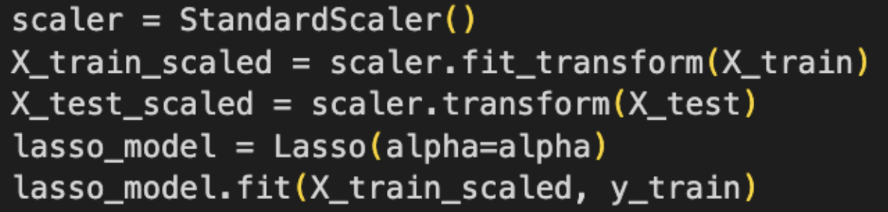
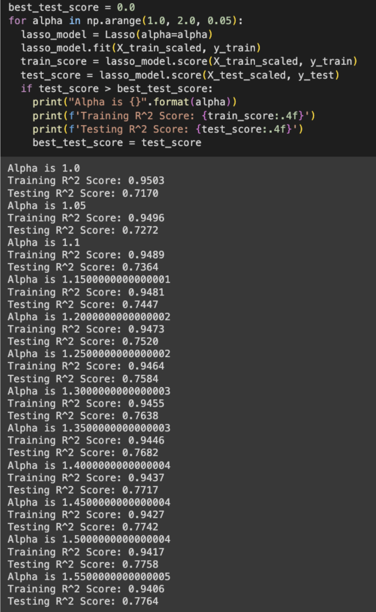
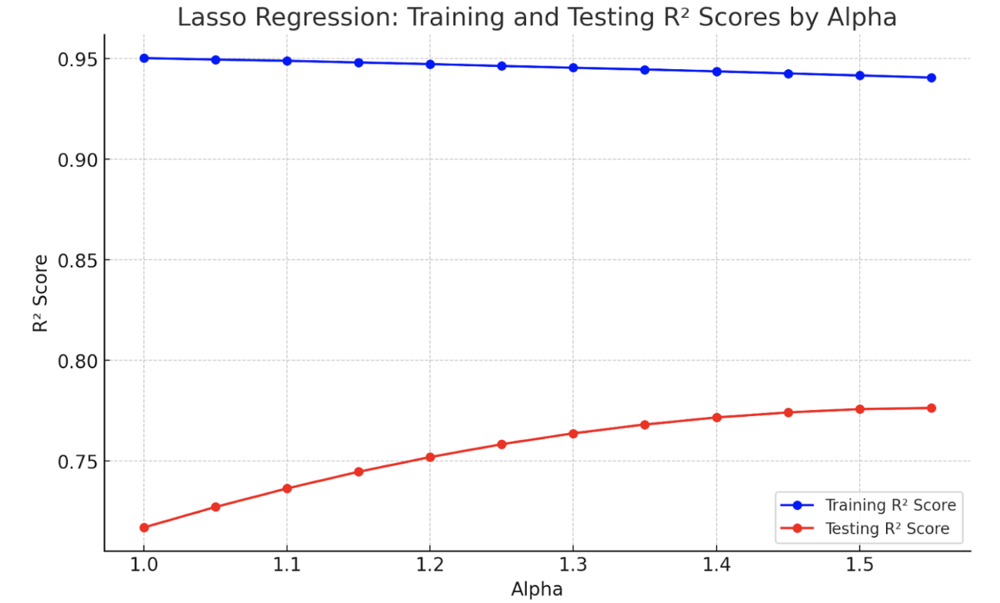
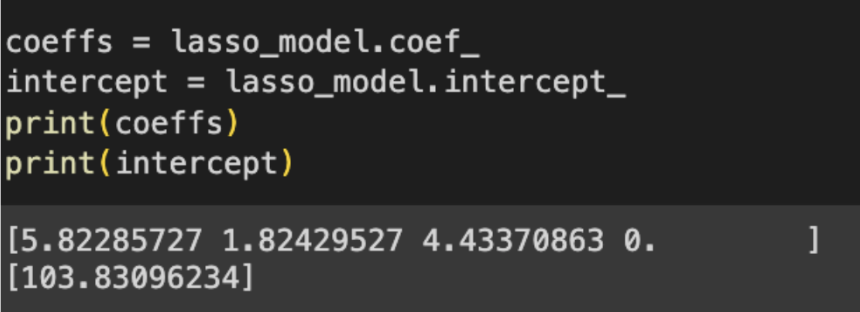
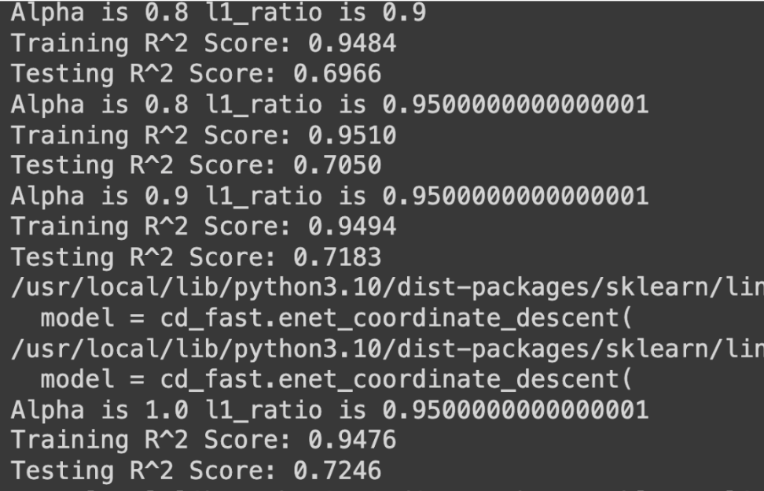
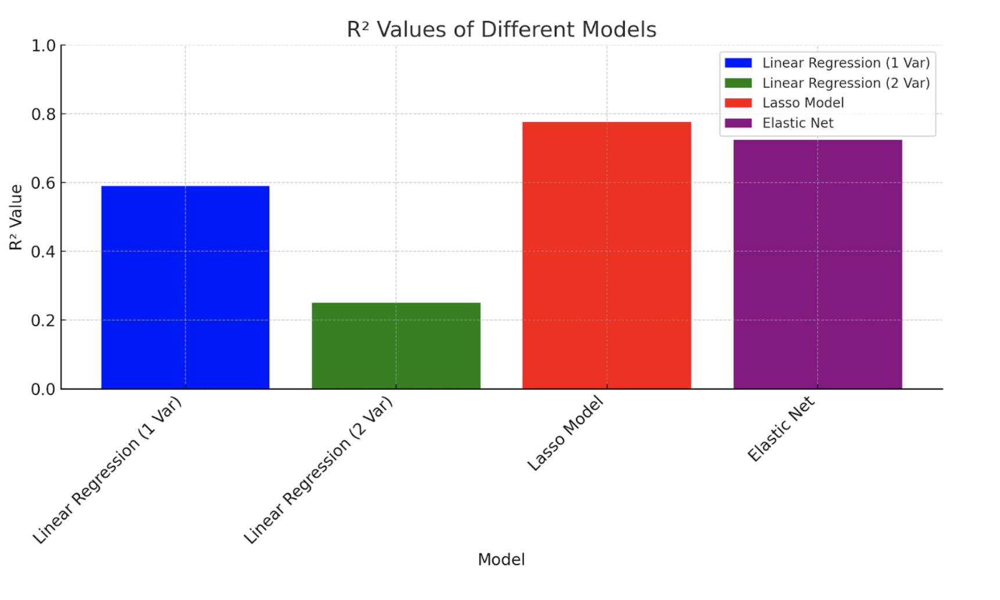

# Correlated Stock Analysis: Regression Techniques & Trading Strategies

## CS 4641: Group 51
## People:
#### Shikhar Ahuja, Abhinav Govindaraju, Akhil Kammila, Devam Shrivastava, Ryan Zhang


## Contribution Table (Not Changed From Midterm)

|        Name        |                       Tasks Assigned                         |
|--------------------|--------------------------------------------------------------|
| Shikhar Ahuja      |  Design and Selection, Feature Reduction, Results Evaluation |
| Abhinav Govindaraju|    Design and Selection, Data Cleaning, Results Evaluation   |
| Akhil Kammila      | Design and Selection, Data Visualization, Results Evaluation |
| Devam Shrivastava  |        Implementation and Coding, Results Evaluation         |
| Ryan Zhang         |        Implementation and Coding, Results Evaluation         |

## Final Video
Here is [our final video link](https://www.youtube.com/watch?v=opjfNa-MjuY)

## Final Presentation
Here is [our final presentation link](https://docs.google.com/presentation/d/1-C6i3MHYhkXlvUSUpVd4RdmZjC_ZStOVU1hVObTvAxA/edit#slide=id.g4dfce81f19_0_45)

## Task Breakdown
We have our [Gantt Chart](https://docs.google.com/spreadsheets/d/1gmkqb4Gtm3RZGYnDpThMwq_offGcSGR-7dkz0H9TepM/edit?usp=sharing) linked here which breaks down our individual tasks and team-based deadlines

## Introduction
The finance industry presents a constant challenge to data-driven investors. An investor who finds meaningful patterns in stock price datasets can stand to make significant amounts of money. For this reason, there has been tremendous research in analyzing stock price datasets with various techniques. Employing ML is no exception.

There are countless ML strategies that are commonly used to analyze stocks. Some include NLP for sentiment analysis, deep learning for pattern recognition, and transfer learning for directional stock predictions. Our project will focus on two specific techniques. The first is *correlation analysis* (Data Preprocessing) to determine which pairs of stocks are highly correlated. Then, we will apply *linear*, *lasso* and *elastic net regression* (2-3 Algorithms/Models) to predict the closing price of a stock based on its correlated pair.

## Background
Vast amounts of research has been conducted into linear, lasso and elastic net regression as well as correlation analysis on stocks. For instance, Wu utilized lasso regression and correlation analysis to develop models to aid in stock predictions among stocks with varying correlations. Current research primarily focuses on stocks that are only positively correlated. However, Wu considers stocks that are negatively correlated as well, which we aim to do in our project. Altelbany has shown that elastic net regression outperforms both lasso and ridge regression in most situations when working with highly correlated data. As elastic net regression combines aspects of both ridge and lasso regression, we seek to compare the performances of elastic net regression to lasso regression on stocks of varying correlations. Linear regression is also commonly used in stock market predictions, although it has been shown to be less accurate than other techniques such as utilizing neural networks. We plan on using linear regression as a base method in order to compare it with lasso and elastic net regression which are well suited for feature reduction tasks. Furthermore, we will use correlation matrices to aid in the process of finding stock pairs that are highly correlated. The vast array of stocks to trade lends itself to using correlation matrices to succinctly represent the relationship between them, which can be utilized to find stock pairs of interest.

## Problem
Our problem is to identify correlations between stocks using correlation matrices in order to pair similar stocks together. Then, we will develop regression models that predict closing prices of a stock based on the trend of closing prices for its pair. We found that identifying pairs of correlated stocks can help us more accurately predict a stock by utilizing information about a stock and its pair. Another benefit of correlated stocks is that it will discern and amplify the underlying factors influencing stock movements. Ideally, in the future we would like to run mean reversion techniques on pairs to generate money. Our dataset will be Yahoo finance data on hundreds of the top Average Price Dollar stocks. We will use data spanning from the past 1.5 years to the past 0.5 years to train the regression model.

### _Dataset_
The dataset is obtained through a Yahoo finance API call, so it cannot be linked. Below is the code, which can be run to programmatically get the dataset:
```Python
ticker_list = 'TGT TSLA F GM  MSFT ETSY SPOT NVDA AMD META BABA PYPL NFLX SQ CRM XOM TEAM TWLO V UNH JPM SBUX ADBE BA NIO BAC PANW SNOW COP PDD CVX AVGO FIS EL MRNA QCOM WFC HD INTC OXY ENPH PFE INTU GS CAT NKE DIS TMUS TXN LLY MU CRWD MA NOW LRCX SHOP CVX AMGN JNJ CMCSA MCD DKNG SLB MRK TMO BILL CSCO ROKU HON HUM NET AMAT PG DHR T ADI CI MCHP SCHW PEP LMT WMT C WDAY VZ ACN BMY MRVL DDOG MNST EXP GM ILMN MRO KO IBM PNC ORCL ZS DOW ANET ADSK PLTR FSLR MAR AXP HAL CCL MDB FTNT UAL RTX BIDU VLO AAL UPS RCL HPQ PGR TJX LVS ADP CNC YUM GD OKTA PINS LULU DAL DPZ ATVI SNAP ZM EBAY AEP CL EA SNPS MGM MTCH WB TTWO PAYC LCID DOCU ZI BILI PLUG K COF SPLK CHWY PTON BURL LUV Z LYFT AKAM UBER'.split()

ticker_list = tuple(ticker_list)

start = dt.date.today() - dt.timedelta(days = int(365.25*1.5))
mid = dt.date.today() - dt.timedelta(days = int(365.25*0.5))
end = dt.date.today()

dataset = yf.download(list(ticker_list), start=start, end=mid)
```
The dataset is shown/described in more detail in “methods.”

## Methods: 
We intend to correlation on stocks that are highly correlated. First, we must identify which stocks to analyze. We will find the correlations between different pairs of stocks from hundreds of the top Average Price Dollar stocks. We will then choose a target stock which will be predicted with regression models.

Next, we will perform linear, lasso and elastic net regressions on the chosen stock(s). We decided to use lasso regression as it is well suited for feature reduction in regression tasks,  elastic net regression as it is a combination of lasso and ridge regressions. Our models will be implemented using scikit-learn and numpy/pandas. Additionally, for testing, we will use RMSE values to evaluate the model performances.
 


## Data Collection and Processing:
### Initial Data:
To start, we pull data from Yahoo Finance. As previously mentioned, we are looking at companies with high Average Dollar Volume, which is (average price * volume). 


We are pulling data from 1.5 years ago to 0.5 years ago for our training data. The rest (0.5 years ago until today) will be used for testing.


This gives us our initial data. For every day in our time range, we have a list of values for each stock, for various metrics such as Adjusted Close, Volume, Open, High, Low, etc.


### Preprocessing Data:
Our goal is to get pairs of highly correlated stocks. This is so that we can run mean reversion strategies on the pairs (after we analyze their means with techniques like Support Vector Regression).

We are interested in stocks with correlated prices. To do this, we first choose a price metric. Adjusted Close is a suitable price metric because it provides the full picture, including factors such as dividends. It is better for long-term price comparisons.


We then find the log difference in prices day-over-day. A table of sample returns is shown below.


We then use the day-over-day returns to find the correlation between each pair of stocks’ day-over-day price differences.


Lastly, we find the pairs with the highest correlation values. Results are shown in the table below (for the top 30 most correlated pairs):


In order to have better input data for some of the models, we implemented a Standard Scaler. This allows certain models (like Lasso and ElasticNet) to perform significantly better.


### Visualizing Data:
We already saw multiple table visualizations of price data and visualizations. Let’s see if we can generate some graph visualizations of how our correlated stocks behave over time.

Our two most correlated stocks are LRCX and AMAT.
We have the day-over-day price difference multipliers (the returns) for these two stocks in table format:


To better visualize, we can graph the returns over time:


While the actual prices vary greatly, we can see that the trends are mirrored in both stocks. We see a peak in June 2022, a dip in July 2022, a peak in August 2022, a valley slightly before November 2022, and so on. The stocks seem to be suitable candidates.

Let us look at a less correlated pair of stocks: MDB and BMY (this was outside or top 30).


Here, there is no notable correlation that we can view. MDB’s peak in August 2022, as well as the dip in November, is not mirrored.
## Results and Discussion:

### Linear Regression
We will run linear regression models on a stock that has several high correlations to others. Using the above data from 1.5 years ago to 0.5 years ago, we will predict the stocks’ future prices (from 0.5 years ago to today). We will then analyze how the predictions fared versus the true price data. If we are successful, this will allow us to run mean reversion strategies in the future across the stock pairs.

The most correlated stock pair is LRCX - AMAT. Additionally, AMAT also had reasonably high correlations with TXN, AVGO, and NVDA. Thus, we will use AMAT as the stock we are predicting. We will test out two linear regression models. The first model will use LRCX as the independent variable and AMAT as the dependent variable. The second model will use LRCX, TXN, AVGO, and NVDA as the independent variables and AMAT as the dependent variable.  

Our hypothesis is that AMAT will have better test accuracy in the model with more parameters, because the variables are more correlated and there is a lower chance of overfitting. Here are the results of our training process.

Now, we conduct this same procedure on the other model, where there are 4 independent variables. Although the training accuracies were higher, the validation accuracies were significantly lower with a mean squared error of 27 and an R^2 value equal to 0.25.  For this reason, we can conclude that the linear regression with one variable outperformed the multilinear regression. 

Although the linear regression did not demonstrate an extremely high R^2, we believe that our process demonstrated some processes that can be extended in our next steps. This motivated our next approach: using Lasso regressions.

### Lasso Regression

Lasso Regressions are especially useful when feature reduction must occur. In our experiments, we utilized Lasso with 5 different input variables, which were scaled. Based on the design of Lasso which sum of the absolute value of the feature components, this approach was necessary. 

From there, we wrote a script that tested out various different values for alpha. If the new Lasso Model using that value image for alpha was currently performing the best, then it was printed. We believe that this is a simple and effective method for parameter optimization.



As can be seen, the best values for alpha lie at approximately 1.55. The alpha increased across the tested values. Additionally, the R^2 score for the Lasso model was 0.7764. This is a substantial improvement on both of the linear regressions performed earlier. These results clearly illustrate the immense power of feature reduction. 
Here are the coefficients and other model data for the Lasso model.


### Elastic

Whilst using Lasso, we pondered the possibility of using a Ridge model and seeing the differences. After some research, we realized that ElasticNets are a clever combination that uses both Lasso and Ridge techniques in conjunction with each other. With a simple approach to the Lasso model, we tested various different parameter values for alpha and L1 (which are the 2 input parameters to the ElasticNet model). Here are the results.

The best Alpha and L1 Ratios were 1.0 and 0.95 respectively. The L1_Ratio being 1 implies that Lasso was the best fit for the model. Additionally, the R^2 for the ElasticNet is slightly lower than the Lasso, which also is consistent with the earlier conclusion. 
We believe that the reason Lasso outperformed both the Ridge and the ElasticNet models is because it decreases the risk of having nonzero coefficients. Thus, Lasso models get less “distracted” by other irrelevant features. 
Perhaps the Elastic Nets would perform better in scenarios where the data was not already somewhat reduced via the aid of the correlation matrices. In that case, both Elastic Nets and Lasso would be very important to provide as much feature reduction as possible.


## Conclusion
Overall, we were able to use various regression models and preprocessing techniques to create high achieving models for time series analysis. We tested 3 types of models: Linear Regressions, Lasso, and ElasticNets. We found that Lasso performed the best due to its capability of reducing coefficients of features to 0. This is reinforced in the below graph of R^2 values:


## Next Steps
Whilst converting these results into trade strategies is far from easy, we believe that there are many avenues that can be explored in the future. There are many mild variations that we plan on working on in the future. We focused our project on a select few stocks that were generally representative of various correlations. Expanding our data analysis process to various different stocks can bear fruitful results. We plan to create a tradeable strategy, and then backtest on historical data. Based on the results, we hope to employ strategies on real markets using real money.

## Sources:

Altelbany, S. (2021). Evaluation of Ridge, Elastic Net and Lasso Regression Methods in Precedence of Multicollinearity Problem: A Simulation Study. Journal of Applied Economics and Business Studies, 5(1), 131-142. https://doi.org/10.34260/jaebs.517

Hiemstra, Y. Linear regression versus back propagation networks to predict quarterly stock market excess returns. Comput Econ 9, 67–76 (1996). https://doi.org/10.1007/BF00115692

Wu, Boyao, The Linear Relationship Model with LASSO for Studying Stock Networks (November 22, 2019). Available at SSRN: https://ssrn.com/abstract=3491575 or http://dx.doi.org/10.2139/ssrn.3491575