# Welcome!

## People:
#### Shikhar Ahuja, Abhinav Govindaraju, Akhil Kammila, Devam Shrivastava, Ryan Zhang

## Contribution Table

|        Name        |                       Tasks Assigned                         |
|--------------------|--------------------------------------------------------------|
| Shikhar Ahuja      |  Design and Selection, Feature Reduction, Results Evaluation |
| Abhinav Govindaraju|    Design and Selection, Data Cleaning, Results Evaluation   |
| Akhil Kammila      | Design and Selection, Data Visualization, Results Evaluation |
| Devam Shrivastava  |        Implementation and Coding, Results Evaluation         |
| Ryan Zhang         |        Implementation and Coding, Results Evaluation         |

## Task Breakdown
We have our [Gantt Chart](https://docs.google.com/spreadsheets/d/1gmkqb4Gtm3RZGYnDpThMwq_offGcSGR-7dkz0H9TepM/edit?usp=sharing) linked here which breaks down our individual tasks and team-based deadlines

## Introduction
The finance industry presents a constant challenge to data-driven investors. An investor who finds meaningful patterns in stock price datasets can stand to make significant amounts of money. For this reason, there has been tremendous research in analyzing stock price datasets with various techniques. Employing ML is no exception.

There are countless ML strategies that are commonly used to analyze stocks. Some include NLP for sentiment analysis, deep learning for pattern recognition, and transfer learning for directional stock predictions. Our project will focus on two specific techniques. The first is correlation analysis to determine which pairs of stocks are highly correlated. Then, we will apply linear regression to predict the closing price of a stock based on its correlated pair. We may also explore PCA for feature reduction in order to choose appropriate stock metrics (Note: this will be done more for the final, the midterm focuses on correlation analysis and linear regression).

## Background
Vast amounts of research has been conducted into both PCA and correlation analysis on stocks. M Ghorbani, for instance, conducted research employing PCA to predict future stock prices of 150 different companies in 2020. He compared PCA to both Gauss-Bayes, which is more computationally expensive, and moving average, which is much simpler. He found that PCA worked better than both of the other methods. PCA has also been shown to improve performances of SVM and linear regression models. This literature informed our own decision to employ PCA mixed with correlation analysis. Furthermore, we will use correlation matrices to aid in the process of finding stock pairs that are highly correlated. The vast array of stocks to trade lends itself to using correlation matrices to succinctly represent the relationship between them, which can be utilized to find stock pairs of interest.

## Problem
Our problem is to identify correlations between stocks using correlation matrices in order to pair similar stocks together. Then, we will develop linear regression models that predict closing prices of a stock based on the trend of closing prices for its pair. We found that identifying pairs of correlated stocks can help us more accurately predict a stock by utilizing information about a stock and its pair. Another benefit of correlated stocks is that it will discern and amplify the underlying factors influencing stock movements. Our dataset will be Yahoo finance data on hundreds of the top Average Price Dollar stocks. We will use data spanning from the past 1.5 years to the past 0.5 years to train the regression model.

## Methods: 
We intend to generate correlations between different pairs of stocks from hundreds of the top Average Price Dollar stocks. We will then choose pairs of stocks which have high correlation and display similar trends.

Next, we will perform linear regressions of the chosen stocks. Our models will be implemented using scikit-learn and numpy/pandas. In the future, we will use the linear regression predictions, as well as the pairs of stocks, to perform mean reversion strategies. Additionally, for testing, we will use RMSE values to evaluate the model performances.

## Data Collectino and Processing:
### Initial Data:
To start, we pull data from Yahoo Finance. As previously mentioned, we are looking at companies with high Average Dollar Volume, which is (average price * volume).
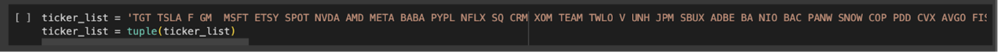

We are pulling data from 1.5 years ago to 0.5 years ago for our training data. The rest (0.5 years ago until today) will be used for testing.
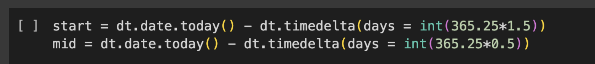

This gives us our initial data. For every day in our time range, we have a list of values for each stock, for various metrics such as Adjusted Close, Volume, Open, High, Low, etc.
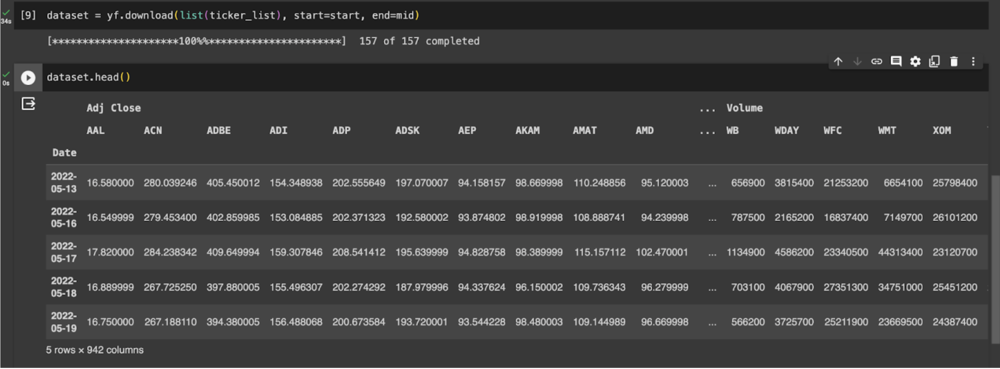

### Preprocessing Data:
Our goal is to get pairs of highly correlated stocks. This is so that we can run mean reversion strategies on the pairs (after we analyze their means with techniques like Support Vector Regression).

We are interested in stocks with correlated prices. To do this, we first choose a price metric. Adjusted Close is a suitable price metric because it provides the full picture, including factors such as dividends. It is better for long-term price comparisons.
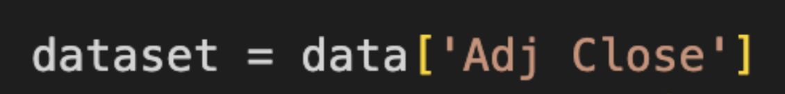

We then find the log difference in prices day-over-day. A table of sample returns is shown below.
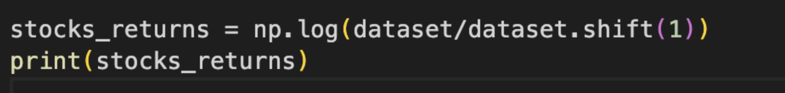
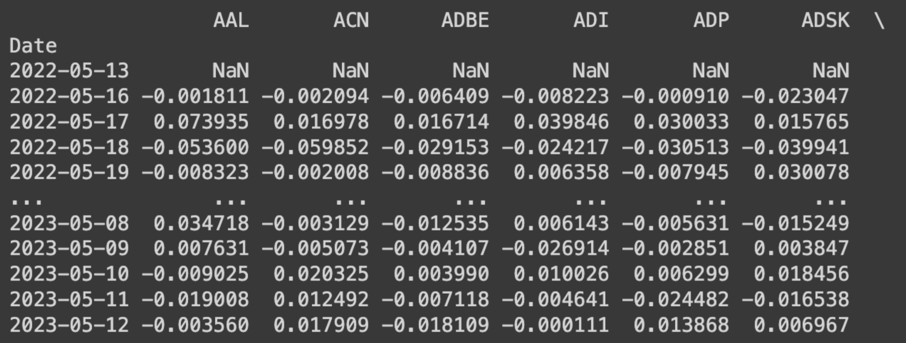

We then use the day-over-day returns to find the correlation between each pair of stocks’ day-over-day price differences.
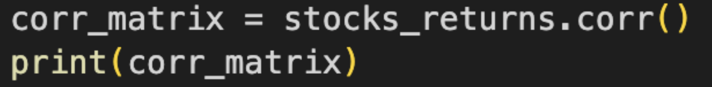
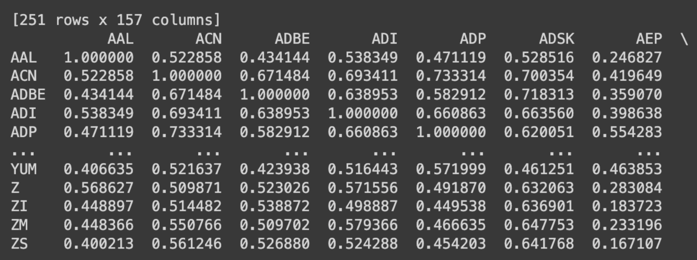

Lastly, we find the pairs with the highest correlation values. Results are shown in the table below (for the top 30 most correlated pairs):
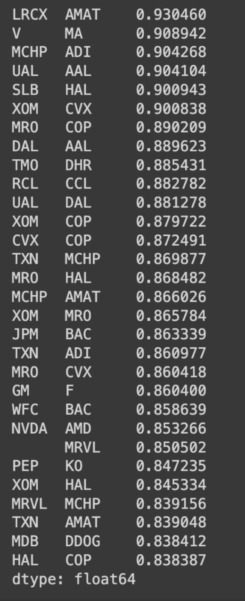

### Visualizing Data:
We already saw multiple table visualizations of price data and visualizations. Let’s see if we can generate some graph visualizations of how our correlated stocks behave over time.

Our two most correlated stocks are LRCX and AMAT.
We have the day-over-day price difference multipliers (the returns) for these two stocks in table format:
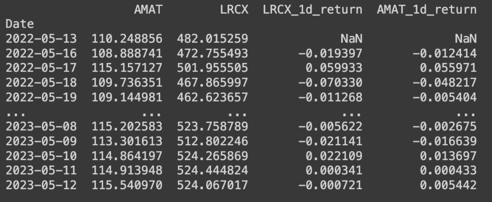

To better visualize, we can graph the returns over time:
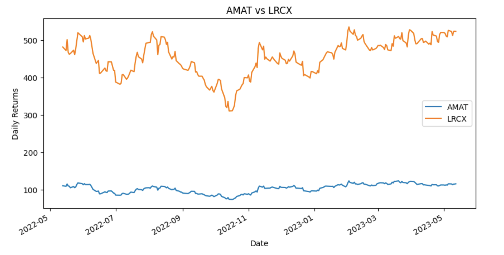

While the actual prices vary greatly, we can see that the trends are mirrored in both stocks. We see a peak in June 2022, a dip in July 2022, a peak in August 2022, a valley slightly before November 2022, and so on. The stocks seem to be suitable candidates.

Let us look at a less correlated pair of stocks: MDB and BMY (this was outside or top 30).
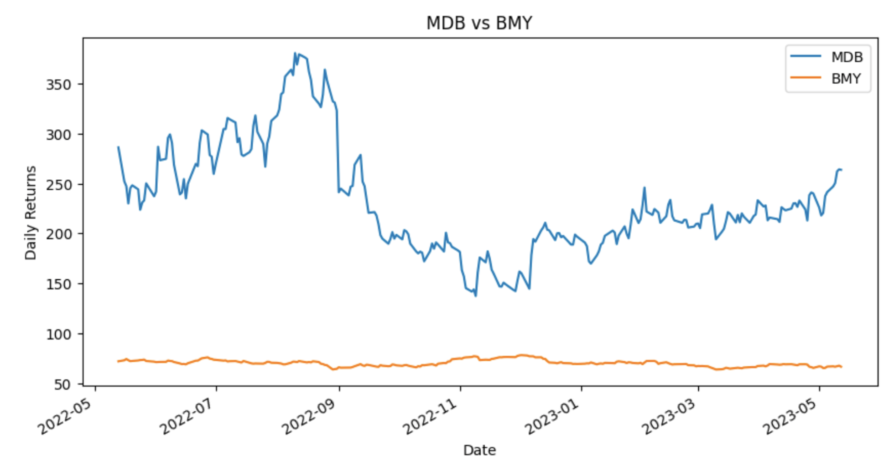

Here, there is no notable correlation that we can view. MDB’s peak in August 2022, as well as the dip in November, is not mirrored.
## Results and Discussion:
We will run linear regression models on our pairs of correlated stocks. Using the above data from 1.5 years ago to 0.5 years ago, we will predict the stocks’ future prices (from 0.5 years ago to today). We will then analyze how the predictions fared versus the true price data. If we are successful, this will allow us to run mean reversion strategies in the future across the stock pairs.

The most correlated stock pair is LRCX - AMAT. Additionally, AMAT also had reasonably high correlations with TXN, AVGO, and NVDA. We will test out two linear regression models. The first model will use LRCX as the dependent variable and AMAT as the independent variable. The second model will use LRCX, TXN, AVGO, and NVDA as the independent variables and AMAT as the dependent variable. 

Our hypothesis is that LRCX will have a better test accuracy than the model with more parameters, because the variables are more correlated and there is a lower chance of overfitting. Here are the results of our training process.
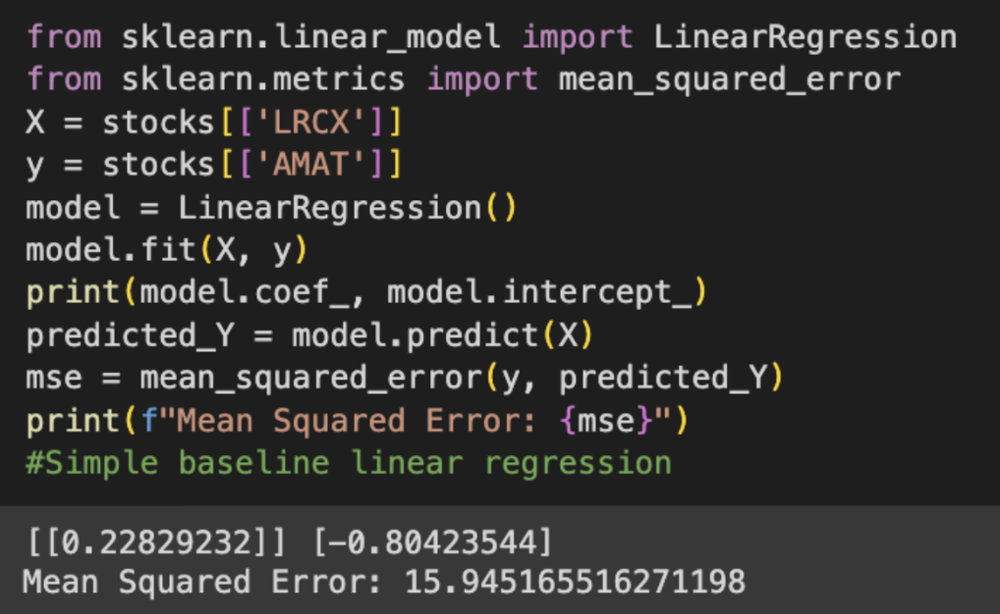

The mean-squared error of the model on training data is 15.94. On the testing data, here is the R^2:
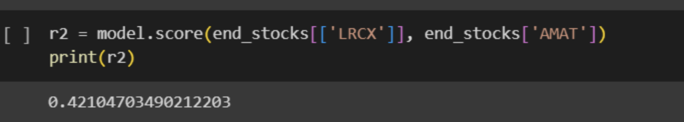

The final mean squared error was
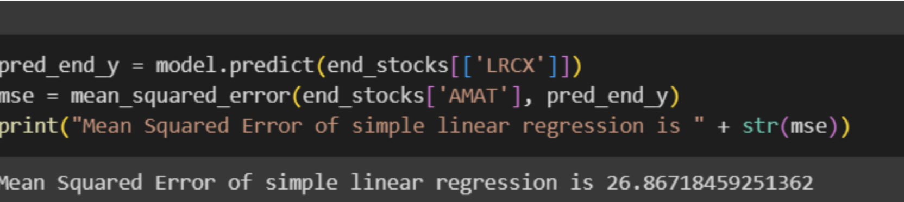

Now, we conduct this same procedure on the other model, where there are 4 independent variables. Although the training accuracies were higher, the validation accuracies were significantly lower with a mean squared error of 97 and an R^2 value that was below 0. For this reason, we can conclude that the linear regression with one variable outperformed the multilinear regression. 

Although the linear regression did not demonstrate an extremely high R^2, we believe that our process demonstrated some processes that can be extended in our next steps. For example, we were able to prove that reducing features to the most correlated variables in the correlation matrix increases the accuracies of the outputs. Additionally, we believe that our outputs can be applied successfully into trading strategies that are based on supervised learning techniques. For our final proposal, we will utilize regressions in conjunction with statistical strategies such as Mean Reversions to demonstrate the efficacy of a trading strategy over time.

## Sources:

Anass Nahil, Abdelouahid Lyhyaoui. Short-term stock price forecasting using kernel principal component analysis and support vector machines: the case of Casablanca stock exchange, Procedia Computer Science, Volume 127, 2018, pp. 161-169, doi: https://doi.org/10.1016/j.procs.2018.01.111.

Ghorbani M, Chong EKP. Stock price prediction using principal components. PLoS One. 2020 Mar 20;15(3):e0230124. doi: 10.1371/journal.pone.0230124. PMID: 32196528; PMCID: PMC7083277.

M. Waqar, H. Dawood, P. Guo, M. B. Shahnawaz and M. A. Ghazanfar, "Prediction of Stock Market by Principal Component Analysis," 2017 13th International Conference on Computational Intelligence and Security (CIS), Hong Kong, China, 2017, pp. 599-602, doi: 10.1109/CIS.2017.00139.
